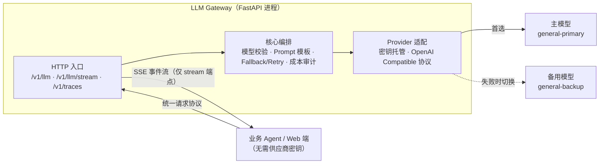
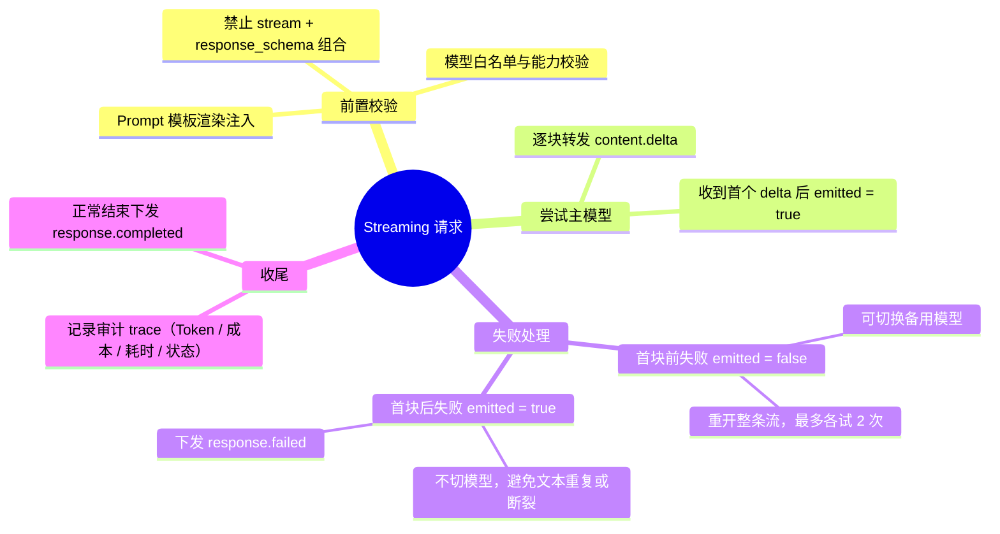
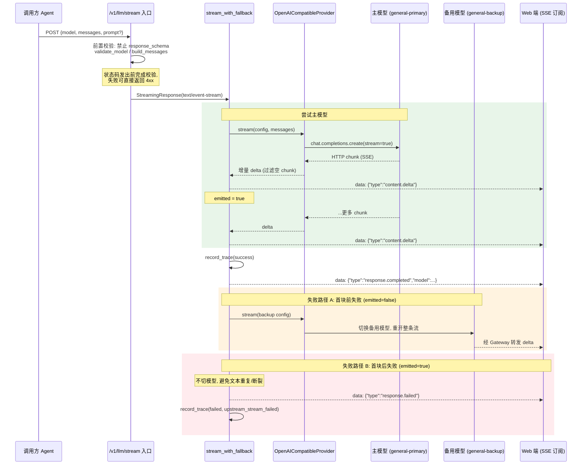

# Agent LLM Gateway

## 安装与启动

```bash
python3 -m pip install -r requirements.txt
export DEEPSEEK_API_KEY='你的主模型密钥'
export DEEPSEEK_BACKUP_API_KEY='你的备用模型密钥'
uvicorn gateway:app --reload --port 8000
```

主模型和备用模型的实际模型名、Base URL 可通过 `PRIMARY_PROVIDER_MODEL`、`PRIMARY_BASE_URL`、`BACKUP_PROVIDER_MODEL`、`BACKUP_BASE_URL` 配置。密钥只由 Gateway 进程读取；调用 Gateway 的 Agent 不需要保存供应商密钥。

## 非流式调用

```bash
curl http://127.0.0.1:8000/v1/llm \
  -H 'content-type: application/json' \
  -d '{"model":"general-primary","messages":[{"role":"user","content":"解释什么是 LLM Gateway"}]}'
```

## Structured Output

```bash
curl http://127.0.0.1:8000/v1/llm \
  -H 'content-type: application/json' \
  -d '{"model":"general-primary","messages":[{"role":"user","content":"返回一个答案"}],"response_schema":{"type":"object","properties":{"answer":{"type":"string"}},"required":["answer"],"additionalProperties":false}}'
```

## Streaming

```bash
curl -N http://127.0.0.1:8000/v1/llm/stream \
  -H 'content-type: application/json' \
  -d '{"model":"general-primary","messages":[{"role":"user","content":"用一句话解释流式输出"}]}'
```

SSE 事件为 `content.delta`、`response.completed` 或 `response.failed`。流开始后不切换备用模型，避免重复或断裂文本。

## Prompt 模板

请求可附带 `prompt`，由 Gateway 追加受版本控制的系统消息，调用方不能上传模板正文：

```json
{
  "name": "knowledge_decision",
  "version": "v1",
  "variables": {"product_name": "差旅助手"}
}
```

调用审计记录在 `GET /v1/traces`，默认仅保留 Token、成本、耗时、模型、模板版本、尝试次数和状态，不保存 Prompt 或模型回答。


curl http://127.0.0.1:8000/v1/traces

## 架构图

只画数据主链路，Gateway 内部三层自上而下：



## 核心流程：思维导图

Streaming 请求的完整决策分支，一图总览：



## 核心流程：时序图

