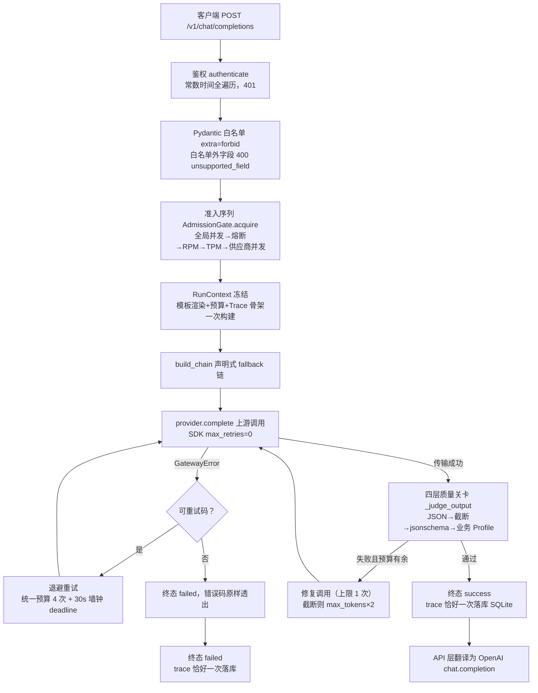
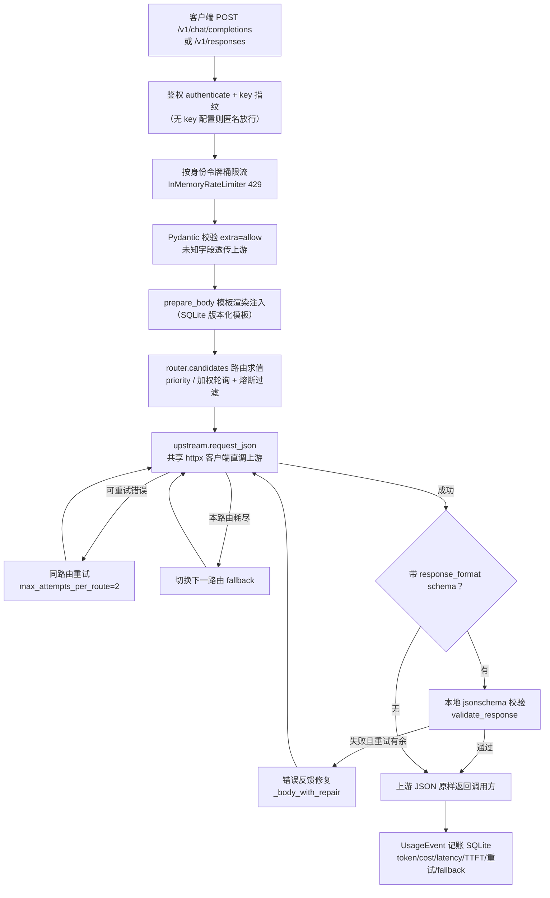

# beacon-llm（作业）与课程 llm-gateway（示例）对比分析

> **总体结论**：同源同题，两条路线——课程示例是聪明的透明代理，赢在协议覆盖与调用方兼容（Responses API、字段透传、加权路由、断点续传）；作业是严格的协议终止网关，赢在内部工程质量（统一预算、封闭错误码、多层准入、四层校验、行为级测试）。作业的主要欠账在治理面安全与上游错误分类。

## 0. 对比对象与口径

| | 课程示例 | 作业 |
|---|---|---|
| 位置 | `course_code/week01/1-7/llm-gateway/` | `/home/wissfi/projects/beacon-llm/` |
| 规模 | 约 1870 行 Python（含测试，16 个源文件）+ 6 个测试用例 | 约 5000 行源码 + 7600 行测试（306 个测试函数，unit/contract/live 三层） |
| 结构 | `app/` 单应用（api/core/services 三块） | `src/llm_gateway/` 分层包（api/services/core/providers/prompt/storage/observability/validation）+ `packages/modelport` 客户端包 |
| 演进 | 课程提供的 1-7 参考实现（README 注明借鉴 CC Switch 的模块化思路） | M01 从 1-6 单文件 demo `gateway.py` 等价迁移起步，经 M02–M12 共 12 个自写 spec 里程碑演进（见 `docs/specs/`、`docs/adr/`） |
| 部署 | Dockerfile + docker-compose（healthcheck、非 root） | Dockerfile（uv 锁定、非 root）+ compose + GitHub Actions CI |

两者要解决的是同一道题（1-7「可部署、可治理的 LLM Gateway」）：OpenAI 兼容入口、多模型路由与 fallback、流式、结构化输出、Prompt 模板、鉴权限流、用量观测、测试与容器化。以下所有结论都基于通读两个项目的全部源码、配置、测试与文档；引用格式为 `文件路径:行号 或 函数名`。

---

## 1. 核心链路对比

### 1.1 作业（beacon-llm）一次非流式调用的主链路

逐步职责（引用 beacon 源码）：

1. **鉴权**：`src/llm_gateway/api/chat.py:341` 调 `core/auth.py:34` 的 `authenticate()`，对 `config/callers.yaml` 调用方表做 `hmac.compare_digest` 常数时间比较。注意它**遍历完全部键才判定**（`core/auth.py:44` 注释：提前短路会泄漏"表中第几个键命中"到响应时延），失败一律统一 401。
2. **请求规范化**：`api/schemas.py:31` 的 `ChatCompletionRequest` 用 `extra="forbid"` 封闭白名单（7 个 OpenAI 标准字段 + `prompt`/`validation` 两个扩展字段）。白名单外字段在 `api/errors.py:98` 翻译成 400 `unsupported_field`，**上游请求数为 0**（有契约测试 `tests/contract/test_field_whitelist.py:34` 断言）。OpenAI 方言（`response_format` 的包装结构、SSE chunk 格式）在 `api/chat.py:151` 的 `_translate_response_format` 和 `_chunk_stream` 一次性翻译为内部协议，此后全链路只见内部类型。
3. **准入控制**：`core/ratelimit.py:47` 固化顺序 `ADMISSION_ORDER`：全局并发（默认 20）→ 熔断 → 每模型 RPM（令牌桶）→ TPM（60s 滑动窗口**事后记账**）→ 每供应商并发（默认 10）。任一层拒绝即抛对应 429/503 并反序释放已持有资源（`AdmissionGate.acquire`）。
4. **上下文冻结**：`services/run_context.py:162` 的 `build_run_context()` 一次性构建不可变 `RunContext`：渲染完成的 Prompt（`prompt_service.py:33` 的 `build_messages` 把模板系统消息注入消息列表）、Schema、Validation Profile、预算实例、request_id、Trace 骨架。**构建后全链路只读**——在途回合不受模板热加载影响，这是 trace 可解释性的地基。
5. **模型路由**：`services/routing.py:22` 的 `build_chain()` 读取 `config/models.yaml` 的声明式 `fallback` 字段生成候选链（`general-primary → general-backup`），去重保序。路由决策逐条留痕（`route_reasons`），终态时随 trace 落库。
6. **上游调用**：`services/invocation.py:288` 经 Provider Protocol（`providers/base.py:71`）调用具体 Adapter。`openai_compatible.py` 支持两种上游传输（`provider_api: chat | responses`），`anthropic_provider.py` 是 Anthropic Messages 原生实现。所有 SDK 一律 `max_retries=0`（`openai_compatible.py:56`）——**网关是重试的唯一权威**。
7. **重试与 fallback**：`invocation.py:256` 的 `_run_chain()` 是唯一状态机。统一预算 = 总尝试 4 次（`run_context.py:31` 的 `RUN_BUDGET_ATTEMPTS`）+ 30s 墙钟 deadline（`core/schemas.py:54` 默认值）；单候选上限按"预算 − 后续候选数"动态留量（`invocation.py:280`），保证 fallback 链上每个候选至少有一次机会。可重试码只有 `MODEL_UNAVAILABLE`（连接/超时/5xx）和 `PROVIDER_OVERLOADED`（429）（`providers/base.py:35` 的 `PROVIDER_RETRYABLE_CODES`）。
8. **结构化输出校验与纠错**：`invocation.py:134` 的 `_judge_output()` 四层关卡：`json.loads` → 截断判定（`finish_reason == "length"`，截断与"不会写 JSON"是两种病）→ 本地 `jsonschema` → Validation Profile（Pydantic 业务规则，`validation/profiles.py:17` 的 `OrderDecision` 拦截"互斥字段同真"这类结构合法但业务非法的输出）。失败携带具体错误反馈修复重调（上限 1 次，消耗同一预算；截断修复把 `max_tokens` 翻倍），仍失败才报错。
9. **用量与 Trace 落库**：终态迁移（success/failed/cancelled 三选一恰好一次，`run_context.py:103` 的 `TraceDraft.finalize` 幂等）时 `trace_service.py:54` 的 `record_trace()` 计算成本（按 `config/prices.yaml`，带 `price_version` 快照）并调度异步落库 SQLite（`storage/models.py:25` 的 `TraceRow` 19 字段；`request_id` 唯一约束是"恰好一次落库"的底层防线）。trace **永不记录消息内容**。
10. **响应返回**：`api/chat.py:198` 的 `_to_chat_completion()` 把内部 `LLMResponse` 翻译为 OpenAI `chat.completion` 结构（响应模型也 `extra="forbid"`），`id` 复用 `request_id` 可与 `/v1/traces` 对账。

流式分支（`invocation.py:361` 的 `stream_with_fallback`）：上游事件先收编为内部类型化事件流（`ContentDelta`/`StreamCompleted`），再由 `api/chat.py:228` 的 `_chunk_stream` 一次性翻译为 OpenAI chunk 线格式。语义铁律：**首块前**可重试可 fallback（与非流式同节奏）；**首块后**失败只发一个流内错误事件后终止，绝不换模型重生成（`invocation.py:449-455`）。取消传播经 `aclosing` 关闭下游流，落单一 `cancelled` 终态。

### 1.2 课程示例一次非流式调用的主链路

逐步职责（引用课程源码）：

1. **鉴权**：`app/core/security.py:17` 的 `authenticate()`，Bearer 或 X-API-Key 对 `gateway.yaml` 的 `api_keys` 做 `hmac.compare_digest`，返回 key 指纹（sha256 前 16 位）作为限流身份。**未配置任何 key 时直接匿名放行**（按客户端 host 指纹，`security.py:25-26`）——开发友好的 fail-open。
2. **限流**：`app/core/rate_limit.py:17` 的 `InMemoryRateLimiter`，**按调用方身份**的令牌桶（默认 60 RPM/突发 10），全端点生效（`routes.py:24` 的 `limited_identity` 依赖把鉴权和限流串在一起）。全部身份共用一把 `asyncio.Lock`。
3. **请求规范化**：`app/schemas.py:8-9` 的 `FlexibleModel` 用 `extra="allow"`——已知字段做类型校验，**未知字段（tools、logprobs、tool_choice 等）原样透传给上游**。非流式响应也是上游 JSON **原样返回**（`routes.py:51` 的 `JSONResponse(result)`）。
4. **Prompt 装配**：`app/services/gateway.py:47` 的 `prepare_body()`，请求里带 `gateway_prompt: {id, variables, version}` 时从 SQLite 加载模板（`prompts.py:108` 的 `render`，Jinja2 Sandbox + StrictUndefined）注入为 system 消息（chat）或 `instructions` 前缀（responses）。模板经 `POST /v1/prompts` **运行时创建**，同 id 重复提交自动递增版本号（`prompts.py:39` 的 `create_version`，SQLite 事务 + `MAX(version)+1`）。
5. **模型路由**：`app/services/router.py:24` 的 `candidates()`：按 provider 启用状态、**协议能力**（route 声明 `api: chat/responses/both`）和熔断状态过滤；`priority` 按配置顺序，`weighted_round_robin` 按 weight 加权轮询选首选、其余保序作 fallback。不支持 Responses API 的供应商不会被强行伪装（README:127）。
6. **上游调用**：`app/services/upstream.py:47` 的 `request_json()`/`open_stream()`，共享一个 `httpx.AsyncClient` 裸 HTTP 调用，超时/连接超时按 provider 配置。错误分类在 `upstream.py:99` 的 `_http_error()`：`retry_statuses`（默认 408/409/429/5xx，可配置）标记可重试；上游 4xx **状态码原样透传**给调用方（`status = response.status_code if 400 <= ... < 500 else 502`）。
7. **重试与 fallback**：`gateway.py:94-126` 双层循环——外层遍历路由（fallback），内层每路由最多 `max_attempts_per_route`（默认 2）次，指数退避带 ±25% 抖动。**没有全局尝试上限，也没有墙钟 deadline**。
8. **结构化输出**：`app/services/structured.py:44` 的 `validate_response()`：剥 Markdown 围栏 → `json.loads` → `jsonschema.validate`；失败经 `repair_instruction()`（带具体校验错误和完整 schema）反馈给模型修复（`gateway.py:323` 的 `_body_with_repair`，把上次输出和修复指令追加进 messages），上限 `structured_output_retries`（默认 1）次。**没有截断识别，没有业务规则层**；流式模式下 schema 透传给上游但本地不做校验（README:156）。
9. **用量与 Trace 落库**：`app/services/usage.py:14` 的 `UsageEvent`（20+ 字段：token 三键、成本、延迟、TTFT、重试数、fallback 数、错误类型、prompt 版本、key 指纹），请求结束在 `finally` 里落 SQLite（`gateway.py:149-155`）；成本按 `pricing` 配置计算（含 cached token 差异计价，`usage.py:91`），未配置记 0。流式用量从 SSE 里解析（`gateway.py:345` 的 `_collect_stream_data`），需要调用方传 `stream_options.include_usage`。
10. **流式返回**：`gateway.py:157` 的 `stream()`——**SSE 字节流透明转发**（逐 chunk `yield`，网关只旁路解析 usage 和 checkpoint 内容）；客户端断开检测（`is_disconnected()`，499 cancelled）；首块前失败可重试可 fallback，**首块后失败发 SSE 错误事件 + [DONE] 终止**（`gateway.py:242-249`），与作业同一铁律。可选 checkpoint：`stream_checkpoint.enabled` 开启后按时间间隔把已生成文本尾部存 SQLite，断线后凭 `X-Request-ID` 查询找回（`GET /v1/streams/{id}/checkpoint`），默认关闭并在 README:116 明示隐私权衡。

### 1.3 关键差异点及对调用方/运维方的实际影响

| # | 差异点 | 具体差异 | 对调用方的影响 | 对运维方的影响 |
|---|---|---|---|---|
| 1 | **协议覆盖** | 课程：双公开端点（chat + Responses API），路由按能力分派；作业：只有 chat 端点，但上游可接 Responses/Anthropic 协议（provider 层翻译） | 用 Responses API 的存量调用方（如 OpenAI 新版 SDK 的 responses.create）只能接课程网关；作业要求调用方改用 chat 形态 | 作业的"上游协议异构、对外协议单一"让运维面更简单（一套契约测试），课程则要维护两套协议的路由能力矩阵 |
| 2 | **字段策略** | 课程：`extra="allow"` 透传（tools 等字段能过）；作业：`extra="forbid"` 白名单，白名单外 400 | 带 tool_calls 的 Agent 请求在课程网关直接可用，在作业网关被拒（400 `unsupported_field`）——**对 Agent 平台场景这是作业最大的功能性缺口** | 作业的封闭契约行为可穷举测试（`test_field_whitelist.py` 7 个用例）；课程透传则上游行为变化直接传导给调用方，排障要跨两跳 |
| 3 | **响应保真** | 课程：上游响应原样返回（含上游真实模型名和供应商特有字段）；作业：网关重组最小契约（`extra="forbid"` 响应模型），只暴露平台模型名 | 课程调用方能拿到上游原始字段（如某些供应商的 reasoning 字段）；作业调用方拿到的是稳定契约，但**响应字段集合是白名单的**（reasoning 等被丢弃） | 作业的"供应商模型名不出网关"（`CONTEXT.md`）是治理纪律：换供应商对调用方零感知；课程换供应商会改变响应内容 |
| 4 | **重试边界** | 课程：每路由 2 次 × N 路由，无全局上限无 deadline；作业：全链统一预算 4 次 + 30s 墙钟 | 作业失败请求的最坏等待可预期（≤30s）；课程极端场景（每路由都超时）可能拖到分钟级 | 作业的 `attempts` 字段是预算审计值（可对账）；课程的重试次数分散在 retries/fallbacks 两个字段，且上限随路由数放大 |
| 5 | **结构化输出** | 课程：本地 schema 校验 + 修复 1 次（流式不校验）；作业：四层关卡（含截断特判和业务 Profile）+ 修复 1 次，流式直接拒绝（400） | 作业保证"进 Agent Loop 的输出必过业务规则"（不变量 #10）；课程流式结构化输出无任何本地保证（README:156 明示建议用非流式） | 作业复杂度高（修复/截断/Profile 三条修复路径各有测试）；课程实现 70 行搞定核心链路 |
| 6 | **流式失败语义** | 两者共享"首块铁律"；差异在终态标记：课程错误事件后**仍发 [DONE]**（`gateway.py:248`，贴 OpenAI 实际行为）；作业错误事件后**不发 [DONE]**（`api/chat.py:55-58`，[DONE] 是成功终态专属） | 严格按 openai SDK 消费的调用方两者都能正常收场；但自研 SSE 消费者若把 [DONE] 当"流完整结束"信号，课程的行为可能让失败流被误读为完整回答 | 语义之争见 §2.6，两方都有明示理由 |
| 7 | **断点续传** | 课程有 opt-in 流式 checkpoint（默认关，隐私权衡已文档化）；作业无 | 长文本生成断网后课程可找回已生成内容（开了 checkpoint 的前提下） | 课程的 checkpoint 会持久化模型正文——默认关闭是正确默认值；作业直接不做，边界更干净 |
| 8 | **上游错误分类** | 课程：`retry_statuses` 精确分类，上游 4xx 不重试且状态码透传；作业：`map_provider_error` 只识别 429，**其余一切异常（含上游 401/400/403）都映射为可重试的 `MODEL_UNAVAILABLE`**（`providers/base.py:61-68`） | 课程调用方能区分"我的请求被上游拒绝"（收到上游 4xx）与"上游坏了"（502）；作业调用方对确定性 4xx 也会收到 502 model_unavailable | 作业的上游凭据配错（401）会被重试 4 次 + 计入熔断 + 打开 fallback——**确定性故障被当瞬时故障处理**，浪费预算且熔断语义被污染 |

### 1.4 同环节实现方式并排对比

| 环节 | 课程 llm-gateway | 作业 beacon-llm |
|---|---|---|
| **鉴权** | Bearer/X-API-Key 双头，常数时间比较，**无 key 配置时匿名放行**（dev 模式，`security.py:25`）；key 只留指纹 | 仅 Bearer，常数时间**全遍历**（防命中位置泄漏时延侧信道，`auth.py:44`）；callers.yaml 表驱动，**fail-closed**（无 key 一律 401）；caller 身份进 trace |
| **限流** | 单层：**按调用方身份**令牌桶（60 RPM/突发 10），全局一把 asyncio.Lock | 多层准入（`ADMISSION_ORDER`）：全局并发 20 → 熔断 → **每模型** RPM → **每模型** TPM（事后记账）→ **每供应商**并发 10；**无 per-caller 维度** |
| **熔断** | 按**供应商**，二态（连续 5 次失败开 30s，冷却后失败计数清零直接全量放行），`router.py:57-74` | 按**模型**，三态半开（`breaker.py:53-67`：到期转 half_open 只放行 1 个探测请求，成功才闭合）；探测名额可归还（`relinquish_probe` 防幽灵探测）；429 不计失败 |
| **路由策略** | `priority` + `weighted_round_robin`（按 weight 加权轮询），路由声明协议能力（`api: chat/responses/both`） | 仅声明式 fallback 链（`build_chain`，配置顺序即优先级）；路由理由随 trace 落库（`route_reason` 字段，"为什么降级"可审计） |
| **重试** | 每路由 2 次，指数退避 ±25% 抖动，可重试状态码可配置；无全局上限/deadline；自写 httpx 无 SDK 重试问题 | 统一预算 4 次 + 30s deadline，重试/fallback/修复**共享同一计数器**（ADR-0003）；退避 0.5s×2 + 抖动，尊重上游 Retry-After；**所有 SDK `max_retries=0`** |
| **上游协议** | 仅 OpenAI-compatible（httpx 裸调），按路由能力声明分派端点 | openai SDK（chat + responses 两种 provider_api）+ anthropic SDK 原生 + Fake Adapter；SDK 异常不出 providers 层 |
| **Prompt 模板** | SQLite 存储 + **运行时 CRUD API**（POST /v1/prompts 自动版本化、激活版本），Jinja2 Sandbox + StrictUndefined | **文件资产** `templates/<name>/<version>.yaml`，`string.Template` 变量替换，mtime 惰性热加载（坏文件保留旧版继续服务，`loader.py:81-96`）；模板正文不出网关 |
| **结构化输出** | schema 透传上游 + 本地 jsonschema 校验 + 修复 1 次；无截断判定、无业务规则层；流式透传不校验 | 四层关卡（JSON → 截断 → jsonschema → Pydantic 业务 Profile）+ 修复 1 次（截断修复 max_tokens×2）；流式直接 400 拒绝 |
| **流式实现** | SSE **字节透明转发**（只在旁路解析 usage/checkpoint） | 上游流收编为类型化内部事件（`ContentDelta`/`StreamCompleted`），API 层**重组** OpenAI chunk；chunk 的 id = trace request_id；注意 `Provider.stream` 协议签名不含 temperature/max_tokens，**流式请求会静默丢弃这两个字段** |
| **用量/Trace** | `usage_events` 表（token 三键含 cached、成本含 cached 差价、TTFT、重试/fallback 数、prompt 版本、key 指纹）+ stream_checkpoints 表；`/admin/usage`（limit 参数）+ `/admin/routes`（熔断状态） | `traces` 表 19 字段（caller、实际模型、final_endpoint、route_reason、price_version、validation_profile、attempts、三终态）+ Prometheus 7 指标 + 结构化 JSON 日志（脱敏过滤器）；`/v1/traces` 支持 4 过滤 + group_by 聚合 |
| **错误语义** | 异常类层级 + 每类自带 error_type（authentication_error/rate_limit_error/structured_output_error 等多值）+ code 字符串；上游 4xx 状态透传 | **22 码封闭注册表**（Literal 类型层 + 运行时双重封闭，`errors.py:30`）+ 统一 OpenAI 错误体；type 二值（invalid_request_error/api_error）+ Retry-After 头 |
| **指标/日志** | 无 metrics；basicConfig 纯文本日志；错误 message 会带上游原文 | `/metrics` Prometheus 7 指标（每个对应一个机制）；JSON 结构化日志 + `ScrubbingFilter`（密钥子串替换 + sk- 正则兜底 + content/messages 键整键抹除） |
| **测试** | 1 个文件 6 个用例（重试回退、结构化修复、模板注入、流式+checkpoint、Responses+401、限流），httpx MockTransport | 306 个测试函数三层：unit（Fake Adapter 直测编排）/ contract（ASGI + respx，断言"上游请求数恰为 N"这类行为边界）/ live（真模型冒烟，CI 跳过） |
| **部署/CI** | Dockerfile（非 root）+ compose（healthcheck）；无 CI | Dockerfile（uv 锁冻结 + 非 root）+ compose + **GitHub Actions 跑同一条 `make check`**（ruff+pyright+pytest） |
| **客户端 SDK** | 无（调用方直接用 openai SDK） | `packages/modelport` 防腐层：网关错误码→异常类层级映射，"Agent 不导入供应商 SDK"是可测断言 |

---

## 2. 设计取舍与优缺点分析

### 2.1 透明代理 vs 协议终止 + 白名单（最核心的分野）

课程选择"薄"：请求校验已知字段、透传未知字段，响应原样回传，SSE 字节流直通。作业选择"厚"：字段白名单封闭，OpenAI 方言在 API 层一次性翻译为内部协议，响应由网关重组最小契约。

- **课程（透明）优点**：实现量小（`gateway.py` 380 行装下全部编排）；新上游字段（tools、新参数）零改动自动可用——这对 Agent 平台是真实需求；协议保真度高，上游行为可预测地传导。
- **课程（透明）缺点**：网关对契约不可枚举——上游换了，调用方看到的内容就变了；无法在网关层对请求/响应做统一治理（脱敏、审计字段、契约测试只能测"自己 mock 的形态"）；`test_gateway.py` 只有 6 个用例，部分原因是很多行为根本不归它管。
- **作业（终止）优点**：契约封闭可穷举（306 个测试可以断言到"上游恰好收到 4 次请求"）；供应商模型名/端点不出网关（`CONTEXT.md` 治理纪律）；内部协议单一，services 层脱离 HTTP 可测（design.md §2.2 的依赖方向硬规则）。
- **作业（终止）缺点**：白名单是维护负担（OpenAI 加字段要跟）；**工具调用过不去**——`extra="forbid"` 把 `tools`/`tool_choice` 拒之门外，而 Agent 平台的模型调用恰恰离不开工具；流式重组丢失上游特有字段。
- **何时合理/翻车**：调用方少、治理要求高（成本审计、供应商隐藏、稳定契约）时作业的路线合理；调用方多且形态各异、上游能力要快速暴露时课程的路线合理。作业路线翻车的场景就是现在这样——"面向业务 Agent 的网关"却不支持 Agent 最核心的 tool_calls；课程路线翻车的场景是上游故障/字段变化直接砸到所有调用方，网关形同虚设。
- **我的判断**：方向上作业做得**更对**（网关存在的意义是治理，透传等于放弃治理），但**收得过早**——白名单应该把 tools 纳入而非止步于 7 字段。这一条是两个项目共同给出的教训：**协议终止是手段，能力覆盖才是目的**。

### 2.2 每路由重试 vs 统一 Run 预算

课程每路由 2 次 × N 路由（无全局上限、无 deadline）；作业所有"再来一次"（重试/fallback/修复）共享一个 4 次计数器 + 30s 墙钟（ADR-0003），且单候选上限动态留量保证链上每个候选至少拿到一次机会。

- **课程优点**：简单直观，每路由独立调参空间大。**缺点**：路由越多总尝试越多（3 路由 = 最多 6 次上游调用，每次最长 120s 超时）；没有 deadline 意味着最坏时延无界；"修复调用"（结构化重试）还会再跑一遍全路由链（`gateway.py:94` 的 while True 回到 candidates 求值），实际放大效应更大。
- **作业优点**：`attempts` 字段就是预算审计值（终态可对账）；deadline 兜底最坏时延；"重试是网关的独占权力"（SDK `max_retries=0`）保证计数器数的就是真实上游请求数——这一点用 Fake Adapter 的 `attempts` 计数器做了可执行断言（`providers/fake.py` 模块注："断言 3 次失败 + 1 次成功恰好 4 次"）。
- **翻车场景**：作业的预算模型翻车在"上游 429 带长 Retry-After"时——退避尊重 Retry-After 但 deadline 只有 30s，重试可能还没醒就到墙钟了（宁可快速失败，取舍自洽但要知道）；课程模型翻车在上游半死不活时把调用方拖住几分钟。
- **我的判断**：作业完胜。统一预算是这次对比里作业最值得迁移回课程设计的机制——课程的 `while True` + 双层 for + 修复重入的循环结构，重试次数实际上由四段代码共同决定，谁也说不清一次请求最多打上游几次。

### 2.3 熔断：二态 per-provider vs 三态半开 per-model

课程熔断（`router.py:57-74`）：连续 5 次失败开 30 秒，冷却到期**失败计数清零、直接全量放行**——没有半开探测。作业（`breaker.py`）：closed → open（30s）→ half_open **只放行 1 个探测请求**，探测成功才闭合，失败立刻重开；另有 `relinquish_probe` 处理"拿到探测名额却没走到上游"的幽灵探测（`invocation.py:275`）。

- 课程方案的问题：冷却结束瞬间全量流量打到尚未确认恢复的上游，若仍故障要再攒 5 次失败才重新打开——保护是"脉冲式"的。且粒度是 provider：一个 provider 上挂多个模型时，A 模型的失败会连坐 B 模型。作业按模型熔断，429 不计失败（限流≠损坏，口径在 `breaker.py` 模块注钉死并有单测防回归）。
- 作业方案的代价：半开名额管理侵入编排层（主模型放行归准入层查、fallback 候选归编排层查，还有名额归还义务）——复杂度是真实的，换来的是探测语义的正确性。
- **我的判断**：作业做得更好，这是教科书式的正确熔断。课程版本在低流量教学场景无伤大雅，但"冷却即清零"在生产会抖。

### 2.4 限流维度：身份 vs 模型/供应商

课程限的是**人**（per-API-key 令牌桶）：防单个调用方打爆网关。作业限的是**资源**（每模型 RPM/TPM、每供应商并发、全局并发）：防上游和网关进程被打爆。**两者互为对方的盲区**。

- 课程的盲区：所有调用方共享上游容量，一个重负载 caller 打满自己的桶的同时也占满了上游；没有并发限制——LLM 是长耗时请求，60 RPM 限制下每个请求跑 30 秒照样堆出 30 个并发连接（作业 ADR-0004 的原话论证）。
- 作业的盲区：**没有 per-caller 配额**。`callers.yaml` 只用于鉴权和 trace 归属，一个 caller 可以吃光某模型的全部 RPM/TPM，其他 caller 被连坐 429。而 `CONTEXT.md` 白纸黑字写着"调用方是配额、审计与一切聚合口径的归属主体"——声明了但没在准入层落地。
- TPM 取舍值得一提：作业用**事后记账**（调用完成后按实际 usage 入账）而非按 max_tokens 预估扣减，理由是预估会把限流收得过死（ADR-0004）；代价是突发尖峰在第一个窗口可能超支。这是诚实的取舍，比假装精确好。
- **我的判断**：两者各对了半边，正确答案是两层都要——per-caller 配额（公平性）+ per-model/provider 容量保护（可用性）。这正好构成作业的 P1 改进项。

### 2.5 结构化输出：两层修复 vs 四层关卡 + 业务 Profile

课程的链路（透传 schema → 本地 jsonschema → 修复 1 次）干净地覆盖了核心场景，测试也证明了修复闭环（`test_gateway.py:57` 断言第二次调用带上"failed JSON Schema validation"反馈）。作业加了三样东西：**截断特判**（`finish_reason == "length"` 时修复动作是提高 max_tokens 而非内容反馈——截断与不会写 JSON 是两种病）、**业务规则层**（Pydantic Validation Profile，拦截"结构合法但业务非法"，如互斥字段同真）、**修复也吃统一预算**。

- 课程缺截断判定意味着：输出被 max_tokens 掐断导致 JSON 不完整时，反馈给模型的是"你的 JSON 不合法"——模型重写一遍还是被掐断，白烧一次调用。
- 作业的业务 Profile 层（ADR-0005 选择代码注册表而非声明式 YAML 规则）理由充分：业务规则形态开放（互斥、条件依赖、跨字段计算），声明式词汇表迟早不够用然后逼你在 YAML 里发明小语言。代价是新增规则要发版——与调用方管理同粒度，可接受。
- 作业的**翻车点**在流式：直接 400 拒绝 stream+response_format。课程选择透传（上游可能原生支持流式 schema 约束，网关不拦）。作业的理由是"流式增量上无法执行本地校验，放行即绕过不变量 #9/#10"——把弱保证和无保证等同了。**透传至少让上游原生约束生效**，课程的处理更务实。
- **我的判断**：非流式链路作业明显更深（截断特判是真实盲点的修复——demo 丢 finish_reason 被作业当成 M04 的定稿理由）；流式分支课程处理得更好。综合：作业 6:4 胜，但流式结构化应列为改进项。

### 2.6 错误语义：开放异常层级 vs 封闭错误码注册表

课程用异常类携带 error_type（多值：authentication_error / rate_limit_error / structured_output_error / upstream_error / service_unavailable_error…），错误体三键 + details；上游 4xx 状态码透传，message 会拼上游原文（`upstream.py:99-111`）。作业用 22 码封闭注册表（Literal 类型层 + 运行时构造期 ValueError 双重封闭，`errors.py:22-29`），调用点禁止字面量，message 默认值单一事实来源，type 二值按状态码分。

- **课程的优点**：type 语义丰富（贴近 OpenAI 官方错误分类，openai SDK 能映射到对应异常子类）；上游 4xx 透传让调用方知道"是自己的问题还是上游的问题"；错误 message 带上游细节，排障友好。**缺点**：错误形态是开放集合，重构易漂移；上游错误原文进响应体有信息泄漏面（供应商名、内部错误细节）。
- **作业的优点**：错误码是稳定对外契约（M02 起双冻结，重构不改码）；封闭性可被单测断言（`test_error_registry.py`）；500 兜底响应体零异常细节（`api/errors.py:143-148`，"响应体永不出现 SDK 异常类名/堆栈/供应商内部信息"）。**缺点**：type 二值把 authentication_error / rate_limit_error 的语义全挤进 code 字段——openai SDK 侧解析后 `e.type` 只有两种，**SDK 的异常子类分发被削弱**（BadRequestError vs AuthenticationError vs RateLimitError 全变 4xx 一类）；上游确定性 4xx 被 `map_provider_error` 归一成 `model_unavailable`（502），调用方失去"改请求即可重试成功"的信号。
- **我的判断**：封闭注册表方向正确（这是对外契约该有的样子），但**type 词表应扩**（这是低成本高收益的兼容性改进），且 provider 错误映射必须细分 4xx——后者是作业的真 bug 级问题（见改进清单 P1）。课程"错误信息丰富 + 透传"的策略在内部平台是优点，在对外网关是隐患。

### 2.7 Prompt 模板：运行时 API + Jinja2 vs 文件资产 + string.Template

课程把模板做成**数据服务**：SQLite 存储、REST CRUD、自动版本化、激活版本管理、Jinja2 Sandbox 渲染（还能跑 if/for 逻辑，`prompts/agent_code_reviewer.jinja2` 那个分层审查模板就是证明）。作业把模板做成**文件资产**：`templates/<name>/<version>.yaml`、版本即文件、mtime 惰性热加载、`string.Template` 只做变量替换、模板正文不出网关（调用方只能选 name/version/variables）。

- 课程的能力上限明显更高（运行时迭代 prompt、条件逻辑、复杂模板）；Jinja2 Sandbox 是安全边界但仍是图灵完备度较高的模板语言，注入面比 `string.Template` 大。
- 作业的"版本即文件"有微妙的正确性：模板变更可走 git review、路径即坐标（元数据与路径不一致按解析失败处理，`loader.py:105-108`）、坏文件保留旧版继续服务（线上一个坏模板不放大为故障）；`string.Template` 只有 `$var` 替换，没有执行任何逻辑的可能——**用能力下限换安全上限**。
- 共同的正确决策：**调用方不能提交模板正文，只能选择模板和变量**（课程的 `gateway_prompt` 结构和作业的 `PromptSelection` 同构）——这是两个项目对 Prompt Injection 治理的共同答案：模板是治理面，不是输入面。
- **我的判断**：教学场景课程方案合适（演示 prompt 工程全貌）；工程场景作业方案更稳（可 review、可回滚、故障隔离）。若做 Agent 平台，运行时 CRUD 的需求是真实的，但应该建立在文件/Git 资产之上（CRUD API 写文件 + PR 流程），而不是绕过版本控制直接写数据库。

### 2.8 观测面：单一账本 vs 双账本（trace + metrics）

课程一个 `usage_events` 表承载一切（含 `retries`/`fallbacks`/`first_token_ms`），查询靠 `/admin/usage`。作业分成两本账：trace 是审计（SQLite，恰好一次，19 字段，可过滤聚合），metrics 是速率（Prometheus 7 指标，`trace_service.py:102` 模块注："指标与 trace 是同一终态事件的两本账"）——终态类指标全部集中在 `record_trace` 唯一出口记账，天然继承"恰好一次"的幂等防线。

- 课程的 cached token 差异计价（`usage.py:98-102`：fresh input 和 cached input 分开算钱）是作业没有的——作业的 `calculate_cost`（`trace_service.py:47`）只有 input/output 两价，**DeepSeek 这类有缓存折扣的供应商成本会被高估**。
- 作业多了课程的全部缺失项：metrics（含熔断状态独热广播、在途请求 Gauge）、结构化 JSON 日志、日志脱敏（`ScrubbingFilter`：已知密钥子串 + `sk-` 正则 + content/messages 键整键抹除——这道防线有专门测试 `test_log_scrubbing.py`）。
- **我的判断**：观测面作业代差级领先，唯一要补的是 cached token 计价（课程已给出参考实现）。

### 2.9 测试与验收哲学：覆盖行为 vs 断言边界

课程 6 个用例覆盖了主干行为（重试回退、修复、模板、流式、鉴权、限流），用 MockTransport 注入上游——教学上足够。作业的 306 个测试建立在三个支柱上：Fake Adapter 剧本化复现五类故障（成功/限流/超时/流中断/坏输出，零随机零时钟依赖）、respx 拦截 SDK 层、live 冒烟单独 marker。

关键是**断言什么**：课程断言"接口返回正确"（如 `calls == [primary, primary, fallback]` 其实也是行为断言，做得不错）；作业进一步断言**边界**："400 时上游请求数 == 0"（失败发生在模型调用之前）、"恰好 4 次而非 4×2"（无隐藏重试）、"终态错误事件只发一次"（`design.md` §7 的验收哲学原文）。`tests/contract/test_admission.py:174` 的"25 个慢请求只有 ≤20 个到上游"是并发上限的行为级证明，这种用例写不出来就是设计有问题（不可测）。

- **我的判断**：这不是 6 vs 306 的数量差异，是验收口径的差异——**"可执行命令证明行为边界"比"接口返回 200"高一个层级**，值得作为以后一切项目的默认标准。

### 2.10 进程内状态与部署：同一取舍，不同诚实度

两者都选了单进程内存状态 + SQLite（限流/熔断单实例假设、SQLite 账本）。课程在 README:217 一段话说明"多副本部署时，应把状态替换为 Redis 等共享存储"；作业用 ADR-0004 专文论证 + 不变量 #17 + 非目标声明（design.md §1）。取舍本身同级，作业把边界写成了可执行的纪律（README:217 vs ADR + spec 验收边界），工程成熟度更高。部署侧作业多出 CI 和 uv 依赖冻结；课程的 compose 有 healthcheck、Dockerfile 非 root，也是合格的。

### 2.11 客户端防腐层：modelport 是超纲的正确答案

课程没有客户端包。作业的 `packages/modelport` 把"Agent 不导入供应商 SDK"做成了**可测试断言**（design.md §4.7：测试断言 agent 代码无 `import openai/anthropic`），网关错误码到客户端异常类的映射表与注册表全集对齐（`client.py` 的 `_ERROR_CLASS_BY_CODE`）。对一个"面向业务 Agent 的网关"定位来说，这是把治理延伸到了调用方——超出课程要求，但方向正确。

---

## 3. 可共同提炼的工程原则

以下原则在两个项目中**各自独立出现**（不是一方抄另一方），因此更值得沉淀。

### 原则一：对外错误语义统一、稳定、封闭

- **课程证据**：`app/core/errors.py:46` 的 `error_payload()`——所有异常统一渲染 OpenAI 风格 `{"error": {message, type, code}}`；`main.py:63` 全局 handler 收口；429 自动附 `Retry-After`。
- **作业证据**：`core/errors.py` 22 码封闭注册表（Literal 类型层 + 运行时双重封闭）+ `api/errors.py` 四个 handler 覆盖 GatewayError/校验错/HTTPException/未捕获异常，500 兜底响应体零细节泄漏。
- **落地方式**：在我自己参与的 Agent 平台（如 AISphere 的 LLM 调用链）中，任何对外 API 的错误码集合都应该有单一注册来源、有封闭性测试（新增码必须改注册处，否则 CI 拒绝），错误体形态全端点统一——调用方按 code 写分支逻辑，而不是解析 message 字符串。

### 原则二：重试收口在单层，SDK 内置重试必须关闭

- **课程证据**：重试只发生在 `gateway.py:94-126` 的一个循环里；自写 httpx 客户端天然无 SDK 重试。
- **作业证据**：ADR-0003 明文"网关是重试的唯一权威"；`openai_compatible.py:56` / `anthropic_provider.py:60` 均 `max_retries=0`；Fake Adapter 的 `attempts` 计数器让"真实上游请求数 = 编排次数"成为可断言不变量。
- **落地方式**：任何多层系统（网关→SDK→连接池）上线前先画一张"谁会重试"的表，把重试权收归一层；验收时断言上游请求数，而不是只看网关日志。这条在 Agent 平台接多模型供应商时尤其关键——三家供应商 SDK 默认重试叠加网关重试，实际放大系数是乘积。

### 原则三：fallback 必须能力等价，不等价的降级宁可不降

- **课程证据**：路由声明 `api: chat/responses/both`，`router.py:34-40` 按协议能力过滤候选；README:127"不会把不支持 Responses API 的供应商强行伪装成 Responses API"。
- **作业证据**：`invocation.py:101-109` 的 `validate_model()` 在入口和**每个 fallback 候选**上都做 `supports_structured_output` 检查；能力不符的候选跳过并记 `unsupported_reason` 进 trace（`invocation.py:265-269`）。
- **落地方式**：模型路由表里给每个候选登记能力向量（结构化输出、工具调用、context window、视觉），降级决策先查能力矩阵再查优先级。"降级到不支持 schema 的模型"比"直接报错"更危险——前者产出静默错误的数据进下游。

### 原则四：不信任模型单次结构化输出，出口二次校验 + 带反馈修复

- **课程证据**：`structured.py:44` 本地 jsonschema 校验（即使上游收到 schema 约束）+ `repair_instruction()` 把具体校验错误和 schema 反馈给模型重试一次；`test_gateway.py:57` 证明修复闭环。
- **作业证据**：`invocation.py:134` 四层关卡 + `_quality_gates` 修复（截断→提高 max_tokens；结构/业务→点名违反项反馈）+ 上游约束缺位时的 system 注入补丁（`openai_compatible.py:37` 的 `_JSON_OBJECT_INSTRUCTION`，注释明说"供应商约束不可信，可能静默降级"）。
- **落地方式**：Agent Loop 里凡是模型输出直接驱动行为（工具调用参数、路由决策、数据写入）的地方，一律本地校验 + 有限次修复（1 次）+ 失败降级——"模型说了 JSON"不等于"合法 JSON"，"合法 JSON"不等于"业务上合法"。

### 原则五：流式"首块铁律"——已见内容绝不重生成

- **课程证据**：`gateway.py:206-249` 的 `emitted` 标志——首块前失败可重试可 fallback，首块后只发 SSE 错误事件终止；README:107 给出理由（"从另一模型续写会产生重复或语义错乱"）。
- **作业证据**：`invocation.py:449-455` 同款铁律（不变量 #7），并有 `test_stream_semantics.py:48` 的"首块后失败不重生成"剧本测试。
- **落地方式**：任何流式转发/生成系统，重试窗口只在"消费者尚未收到任何字节"时开放；一旦下游见过内容，唯一合法的失败动作是终止 + 告知。配合可选 checkpoint（课程方案）处理断线找回，而不是靠重生成。

### 原则六：观测面不落敏感原文

- **课程证据**：API Key 只记不可逆指纹（`security.py:11`）；README:237"Prompt 与用户消息正文也不会写入用量表"；checkpoint 默认关闭并明示隐私前提（README:116）。
- **作业证据**：trace 19 字段无内容字段（`storage/models.py`）；`ScrubbingFilter` 三道防线（`observability/logging.py:54`）+ `test_log_scrubbing.py` 防回归；CONTEXT.md 把"Trace 永不记录消息内容"写成术语定义。
- **落地方式**：日志/trace 的字段白名单制（能记什么枚举清楚，而不是"什么不能记"打补丁）；密钥用指纹标识调用方；正文类数据若确需持久化（如 checkpoint），必须显式开关 + 默认关 + 保留期限。

### 原则七：降级决策可审计 + 保护性状态明示边界

- **课程证据**：`UsageEvent` 记录 `retries`/`fallbacks`/`provider`/`upstream_model`——事后能回答"这次调用谁服务的、降了几级"；README:217 明示限流/熔断是单进程实现及迁移路径。
- **作业证据**：`route_reason` 随 trace 落库（"general-primary: 3 attempts exhausted (model_unavailable); general-backup: circuit_open"这类可读解释，`routing.py:34-43`）+ `final_endpoint` 字段；ADR-0004 + 不变量 #17 把单进程边界写成纪律。
- **落地方式**：Agent 平台里所有自动决策（模型路由、重试、降级、预算截断）都要在 trace 里留下决策理由字符串——出问题时"为什么降级了"要能从数据回答而不是靠猜；所有进程内保护状态（限流桶、熔断器）在架构文档里明示生命周期和水平扩展时的迁移路径。

---

## 4. 作业改进清单（按优先级）

| 优先级 | 改进项 | 依据（来自哪条对比结论） | 改动要点 |
|---|---|---|---|
| **P0** | 治理端点鉴权：`/v1/traces`、`/v1/models`、`/metrics` 目前完全无鉴权（`api/governance.py:112,205` 无任何认证依赖，`chat.py` 模块注自认"演进项"） | §1.4 鉴权行对比；课程全部业务与治理端点（含 `/admin/usage`、`/v1/models`）都走 `limited_identity` 依赖（`routes.py:24-29`），仅 healthz/readyz 豁免 | /v1/traces 暴露 caller、request_id、成本审计数据，是当前最大的安全裸奔面；复用 `core/auth.py` 加最小依赖即可，改动量小收益大 |
| **P1** | provider 错误映射细分：`map_provider_error`（`providers/base.py:61-68`）只识别 429，上游 401/400/403/404 全部映射为可重试的 `MODEL_UNAVAILABLE` | 差异点 #8 + §2.6；课程 `upstream.py:99` 的 `retry_statuses` 精确分类 + 4xx 不重试且状态透传 | 上游凭据配错（401）会被重试 4 次 + 计入熔断 + 触发 fallback——确定性故障被当瞬时故障，既浪费预算又污染熔断状态。按 status_code 细分：非 429 的 4xx 映射为不可重试码（可新增 `upstream_rejected` 或复用现有 400 类码） |
| **P1** | 流式请求静默丢弃 `temperature`/`max_tokens`：`Provider.stream` 协议签名（`providers/base.py:99-107`）没有这两个参数，`_stream_chain`（`invocation.py:431`）调用时不传 | §1.4 流式实现行；核验 `api/chat.py` 流式分支 → `stream_with_fallback` → `provider.stream` 全链路无此二字段 | 调用方传 `stream=true + temperature=0.2` 会静默丢失，与非流式行为不一致且无任何报错——属于隐性契约违背。扩 Protocol 签名并接线（openai/anthropic/Fake 三处 + 契约测试） |
| **P1** | 工具调用支持：请求白名单纳入 `tools`/`tool_choice`/`tool_calls` 消息形态 | §2.1 的核心结论："面向业务 Agent 的网关"不支持 Agent 最核心的 tool_calls 是功能性缺口；课程靠 `extra="allow"` 天然透传 | 需要扩内部协议（Message 支持工具角色、LLMRequest 带工具字段）→ provider 层透传 → 白名单放行 + 能力向量声明（哪些模型支持）。工作量最大的一项，但也是价值最大的一项 |
| **P1** | per-caller 配额：准入层增加调用方维度（每 caller 的 RPM/并发上限） | §2.4；课程按身份限流，作业 `CONTEXT.md` 声称"调用方是配额归属主体"但 admission 无此维度（`ratelimit.py` 的桶全部按 model 键控） | callers.yaml 增加 quota 块；`AdmissionGate.acquire` 增加 caller 参数或新增一层；trace 已有 caller 字段，聚合面现成 |
| **P1** | Provider 客户端复用：`create_client`（`openai_compatible.py:51`）在每次 `complete`/`stream` 时新建 `AsyncOpenAI` | 课程 `UpstreamClient` 共享单例 `httpx.AsyncClient`（`upstream.py:22`） | 每请求新建客户端意味着连接池不复用，TLS 握手成本叠加延迟；按 ModelConfig 键控缓存客户端实例即可。低流量下不是急症，属工程卫生 |
| **P2** | `/v1/traces` 分页/limit：当前全表返回（`governance.py:223-226` 的 `select(TraceRow).where(...)` 无 limit） | 课程 `/admin/usage` 有 `limit` 查询参数（`routes.py:110`，上限 1000） | trace 增长后该端点会变成全表扫描放大器；加 limit + 游标分页，聚合路径加时间窗过滤 |
| **P2** | 错误 `type` 词表扩容：`error_type_for_status`（`api/errors.py:48-53`）二值（invalid_request_error/api_error） | §2.6；课程的多值 type（authentication_error/rate_limit_error 等）更贴近 OpenAI 官方分类，openai SDK 靠 type 分发异常子类 | 不动错误码注册表，只扩 type 映射（unauthorized→authentication_error、429 族→rate_limit_error、circuit_open→service_unavailable_error 等），兼容性纯增益 |
| **P2** | 流式结构化输出：从"400 拒绝"放宽为"schema 透传 + 文档声明弱保证" | §2.5；课程做法（README:156：透传原生 Schema，本地无法校验就明确说，建议严格场景用非流式） | 保留"不做本地校验"的诚实，但把上游原生约束的能力还给调用方；或至少对 `structured_output_mode: json_schema` 的模型放行 |
| **P2** | cached token 差异计价：价格表增加 cached 输入价，trace 记录 cached_tokens | §2.8；课程 `usage.py:91-104` 已实现 fresh/cached 分开计价，作业 `calculate_cost`（`trace_service.py:47`）只有两价 | DeepSeek/OpenAI 都有缓存折扣，按全价计会系统性高估成本；需 Usage 结构 + 价格表 + trace 三处扩字段 |
| **P2** | 错误事件后的 `[DONE]` 语义对齐：当前流内失败后不发 [DONE]（`api/chat.py:55-58`） | 差异点 #6；课程在错误事件后仍发 [DONE]（`gateway.py:248`），与 OpenAI 实际线上行为一致 | 用 openai SDK 的流式消费实测两种收场的兼容性再定；若维持现状，把理由写进 API 文档（现在只在代码注释里） |
| **P2** | 消费 `rate_limit.concurrency` 字段 + weighted 路由策略 | 课程有 `weighted_round_robin`（`router.py:51-55`）；作业 config 里 `concurrency` 字段自己注释"语义未定暂不消费"（`models.yaml:27`） | 两项都是已声明未落地的能力：每模型并发闸（复用 ConcurrencyGate）与加权分流（改 build_chain 或路由层），按需求优先级排期 |

**给课程示例的客观问题清单**（对照作业的可借鉴处，供学习参考）：无全局重试上限与 deadline（路由数放大尝试次数）；熔断无半开探测（冷却即清零全量放行）；限流器全局单锁串行化所有身份（高并发吞吐瓶颈）；dev 模式 fail-open（漏配 key 即匿名放行，配置事故=裸奔）；无 metrics/日志脱敏（上游错误原文进响应体和日志）；测试 6 例无熔断/并发/多身份隔离覆盖。

---

## 附：本次对比的阅读范围

- 课程项目全部源码：`app/` 16 个文件（main/config/schemas、api/routes、core 三件、services 六件）+ README + `gateway.example.yaml` + `tests/` + Dockerfile/compose/Makefile + prompts 模板。
- 作业全部核心链路源码：api（chat/governance/schemas/errors）、services（invocation/routing/run_context/trace_service/prompt_service/catalog）、core（auth/ratelimit/breaker/errors/config）、providers（base/openai_compatible/anthropic）、validation、storage、observability、prompt/loader、templates、packages/modelport、config 三份 YAML、Makefile/Dockerfile/CI、CONTEXT.md、docs/design.md、docs/adr/ 全部 5 篇、docs/specs/M01 + 测试目录清单与代表性用例。
