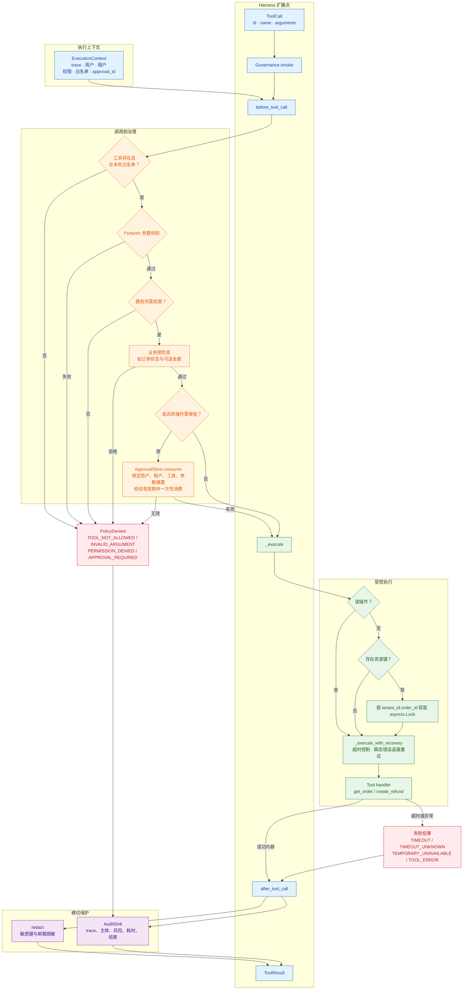
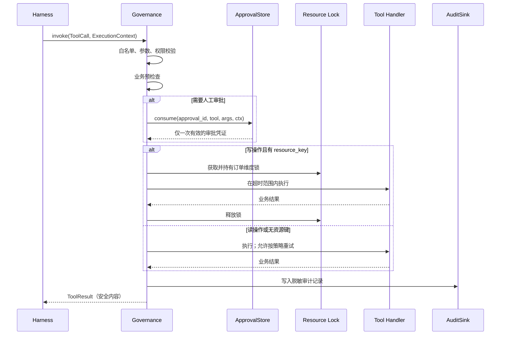

# Tool Governance 架构与调用流程

```mermaid
flowchart TB
    subgraph Harness[Harness 扩展点]
        Call[ToolCall\nid · name · arguments]
        Invoke[Governance.invoke]
        Before[before_tool_call]
        Execute[_execute]
        After[after_tool_call]
        Result[ToolResult]
    end

    subgraph Context[执行上下文]
        Ctx[ExecutionContext\ntrace · 用户 · 租户\n权限 · 白名单 · approval_id]
    end

    subgraph Governance[调用前治理]
        Whitelist{工具存在且\n在本轮白名单？}
        Validate{Pydantic 参数校验}
        Permission{拥有所需权限？}
        Precheck[业务预检查\n如订单状态与可退金额]
        Approval{高风险操作需审批？}
        Consume[ApprovalStore.consume\n绑定用户、租户、工具、参数摘要\n校验有效期并一次性消费]
    end

    subgraph Execution[受控执行]
        Kind{读操作？}
        Recover[_execute_with_recovery\n超时控制 · 瞬态错误退避重试]
        Resource{存在资源键？}
        Lock[按 tenant_id:order_id 获取 asyncio.Lock]
        Handler[Tool handler\nget_order / create_refund]
    end

    subgraph Protection[横切保护]
        Redact[redact\n敏感键与邮箱脱敏]
        Audit[AuditSink\ntrace、主体、风险、耗时、结果]
    end

    Denied[PolicyDenied\nTOOL_NOT_ALLOWED / INVALID_ARGUMENT\nPERMISSION_DENIED / APPROVAL_REQUIRED]
    Failed[失败结果\nTIMEOUT / TIMEOUT_UNKNOWN\nTEMPORARY_UNAVAILABLE / TOOL_ERROR]

    Call --> Invoke
    Ctx --> Before
    Invoke --> Before --> Whitelist
    Whitelist -- 否 --> Denied --> Audit
    Whitelist -- 是 --> Validate
    Validate -- 失败 --> Denied
    Validate -- 通过 --> Permission
    Permission -- 否 --> Denied
    Permission -- 是 --> Precheck
    Precheck -- 拒绝 --> Denied
    Precheck -- 通过 --> Approval
    Approval -- 是 --> Consume
    Consume -- 无效 --> Denied
    Consume -- 有效 --> Execute
    Approval -- 否 --> Execute

    Execute --> Kind
    Kind -- 是 --> Recover --> Handler
    Kind -- 否 --> Resource
    Resource -- 否 --> Recover
    Resource -- 是 --> Lock --> Recover
    Handler -- 成功内容 --> After
    Handler -- 超时或异常 --> Failed --> After
    After --> Redact --> Result
    After --> Audit
    Audit --> Result

    classDef entry fill:#E3F2FD,stroke:#1565C0,color:#0D47A1
    classDef policy fill:#FFF3E0,stroke:#EF6C00,color:#E65100
    classDef execution fill:#E8F5E9,stroke:#2E7D32,color:#1B5E20
    classDef protection fill:#F3E5F5,stroke:#7B1FA2,color:#4A148C
    classDef error fill:#FFEBEE,stroke:#C62828,color:#B71C1C

    class Call,Invoke,Before,After,Result,Ctx entry
    class Whitelist,Validate,Permission,Precheck,Approval,Consume policy
    class Execute,Kind,Recover,Resource,Lock,Handler execution
    class Redact,Audit protection
    class Denied,Failed error
```

## 核心路径

```mermaid
sequenceDiagram
    participant H as Harness
    participant G as Governance
    participant A as ApprovalStore
    participant L as Resource Lock
    participant T as Tool Handler
    participant S as AuditSink

    H->>G: invoke(ToolCall, ExecutionContext)
    G->>G: 白名单、参数、权限校验
    G->>G: 业务预检查
    alt 需要人工审批
        G->>A: consume(approval_id, tool, args, ctx)
        A-->>G: 仅一次有效的审批凭证
    end
    alt 写操作且有 resource_key
        G->>L: 获取并持有订单维度锁
        G->>T: 在超时范围内执行
        T-->>G: 业务结果
        G->>L: 释放锁
    else 读操作或无资源键
        G->>T: 执行；允许按策略重试
        T-->>G: 业务结果
    end
    G->>S: 写入脱敏审计记录
    G-->>H: ToolResult（安全内容）
```
